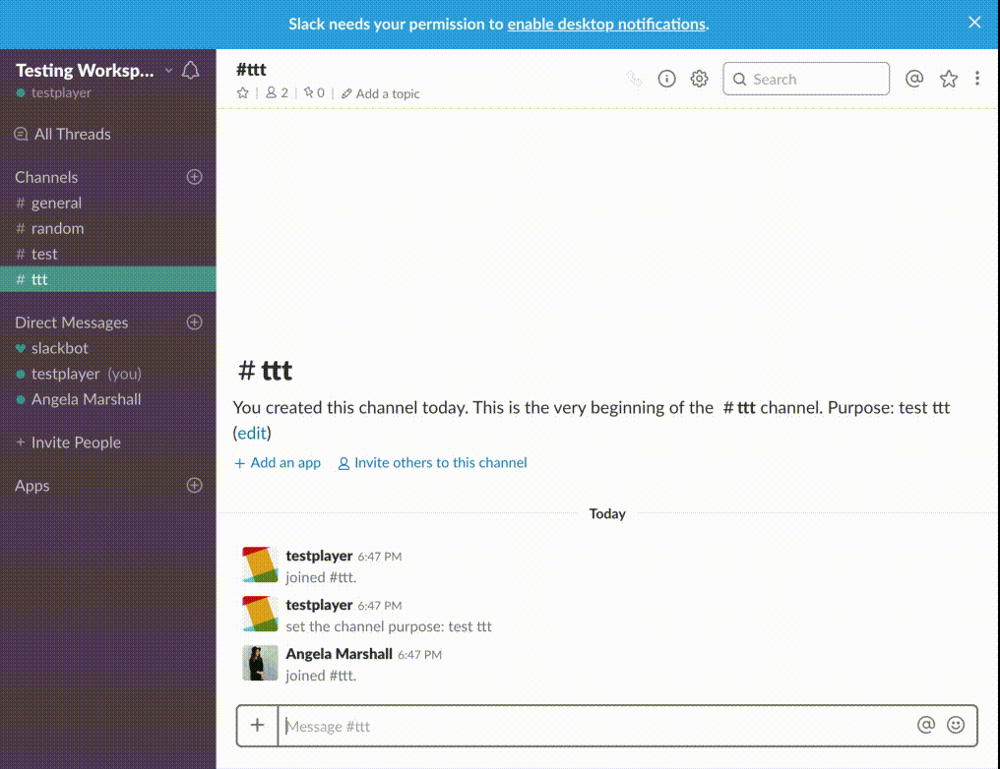

# Tic-Tac-Toe: Slack Slash Command

This is a slash command to play the game of tic-tac-toe with fellow team members in a Slack channel. Not familiar with the rules of the game? Check them out [here](https://en.wikipedia.org/wiki/Tic-tac-toe).

To play the game on Slack, follow these commands:
 - `/ttt challenge [@username]`  - challenges another user in your channel to a game of TTT
 - `/ttt status` - prints the board from an existing game, and displays who goes next
 - `/ttt end` - ends the current game in the specific channel
 - `/ttt move [number]` - enter the number (1-9) that you would like to make a play on

---
### Technologies Used:

 - NodeJS
 - Express JS
 - Knex - a SQL schema and query builder with a javascript sytnax (used with PSQL database)

Heroku is used for deployment at: http://ttt-slackapp.herokuapp.com
